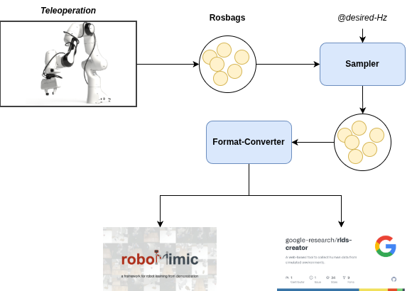
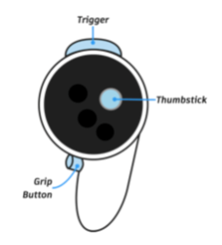
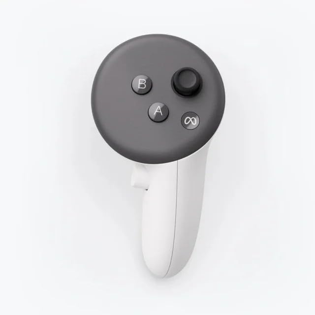

# Franka Teleoperation

This repo provides is a complete docker containerised Teleoperation setup for Franka Emika Panda using [Meta Quest](https://en.wikipedia.org/wiki/Meta_Quest) VR headset.


## Requirements


1. Docker
2. realtime linux kernel

  check by running `uname -a`. It should have `PREEMPT_RT` kernel version.
  If not reboot the system, and select `realtime` kernel from the GRUB options.

3. Meta Quest setup


You will need ROS1 (tested on ROS Noetic), `libfranka`,`franka_ros`, [Franka Interactive Controllers](https://github.com/sophiamoyen/franka_interactive_controllers) and [`franka_zed_gazebo`](https://github.com/pearl-robot-lab/franka_zed_gazebo). The `pose_impedance_control_additional_params.yaml` contains tunable parameters for external tool compensation and nullspace stiffness. When the `cartesian_pose_impedance_controller` is launched in the teleoperation, it looks up that file that should be tuned accordingly (with the ZED2 camera attached to the wrist, for example).


## 0. Docker image
You can get the current docker image of the environment being used for tests. You can follow the instructions on how to download docker and set up an alias for running a container with the required arguments in this repo: [Docker_env](https://github.com/pearl-robot-lab/Docker_env). Pull a docker image and create a container:
```
docker push levoz/franka_teleop:19082025
```
```
docker_run_nvidia --name="franka_teleop" -v <data_collection_folder>:/opt/ros_ws/src/data_collection levoz/franka_teleop:19082025 bash
```
You should now be inside the container. To exit it, just type `exit` in the cmd. From now on, every time you want to enter the container, start it then execute it:
```
docker start franka_teleop
```

```
docker exec -it franka_teleop bash
```

```
cd /opt/ros_ws/src/franka_teleop
git remote set-url origin https://github.com/AnshPrakash/franka_teleop.git
git pull --recurse-submodules
```


## Update ROS_IP 

Update the ROS related IPs in the bashrc for your system

```bash
export ROS_MASTER_URI=http://130.83.144.47:11311
export ROS_IP=130.83.144.47
export ROS_HOSTNAME=130.83.144.47
```

## Update Robot IP

Update the robot IP in the launch script: `/opt/ros_ws/src/franka_teleop/launch/franka_interactive_teleop_real.launch`

### Build & Source

```bash
cd /opt/ros_ws
catkin_make -DFranka_DIR=/opt/libfranka/build/
source devel/setup.bash
```

### Troubleshooting

0. **Can't communicate outside docker**:

  execute `xhost +` to allow all container to use the host network

1. **UDP timeout error**

```bash
sudo iptables -I INPUT 1 -s <robot-ip> -j ACCEPT
```

2. **Quest not found**

Test whether you can detect quest device from within the docker by typing `adb devices`
It should give a similar output; here `340YC10GB814S5` indicates quest connected as USB device.

```bash
root@Naxos:/opt/ros_ws# adb devices
List of devices attached
340YC10GB814S5  device
```

If is an empty list then it is current not detected.
You can follow these troubleshooting methods:

1. Quest generally request for permission to allow the USB connect. Within the quest allow the USB to connect to the computer.

2. Stop the container, and start it again without destroying it.

## Data Collection pipeline

### Step 1:  Record Rosbag


During teleoperation(see `Teleoperation with Quest` section below) data will get recorded under `data-collection` folder. Since this is mounted, it can be accessed outside of docker change the permission of all the data from your system(outside docker) `chmod -R 777 *`.

`Adjust recording Config for your usecase`:

update the following yaml => `/opt/ros_ws/src/franka_teleop/config/recorder.yaml`

```
# List of topics to be recored along with the type

save_folder: <location of data> keep in mind this is within the docker container, so don't forgot to mount it

topics:
  - <topic name1> : <type1>
  - <topic_name2>: <type2>
  ...
  ...

video_topics: If you want to store it as a video
  - ..
```

> Note! `Step 2 and Step 3 can be done outside docker`

### Step 2: Resample

For feeding the data into a learning alogrithm the observations needs to be downsampled to a desired frequency(hyper-parameter), and all of them to have same length. 

As of now, we only do down-sampling so maximum frquency is limited by the lowest frequency observation.(Analysis of frequencies of various topics can also be easily done with the provide code [Check Visualisation section Readme for Sampler])

Use the following [Sampler](https://github.com/AnshPrakash/MimicPlay/tree/main/sampler)

Output is again in Rosbag format, but data is downsampled to a desired frequency.

### Step 3: RLDS or robomimic format


Most of the learning alogorithms expect data to be in certain format. 
Now we convert the Rosbag format(After Step2) to either `RLDS`, or `Robomimic` format.

Follow the steps in the following module: [Rosbag2hdf5](https://github.com/AnshPrakash/MimicPlay/blob/main/rosbag2hdf5/README.md)


<p align="center">
  
</p>


## Teleoperation with Quest


## 1. Start Franka controllers
### Simulation
If you haven't already, launch the simulation with the controllers. You need to have the package `franka_zed_gazebo` to launch in simulation (the launch file is getting the world and the robot description from that package; already setup in docker)

With the ZED2 attached to the end-effector(check *External tool compensation* below ):

```bash
roslaunch franka_teleop franka_interactive_teleop_simulation.launch
```

Without camera:
```bash
roslaunch franka_teleop franka_interactive_teleop_wo_camera_simulation.launch
```

### Real World

1. **External tool compensation**

It is possible that you are having a mounted camera or a different gripper which can change the weight of the End-effector. Since, we are using
impedence controller we will need to take this into account.

Follow this [tutorial](https://github.com/nbfigueroa/franka_interactive_controllers/blob/main/doc/instructions/external_tool_compensation.md) to get the calibrated values for External tool compensation, and adjust the values in `/opt/ros_ws/src/franka_interactive_controllers/config/impedance_control_additional_params.yaml`.

2. **Camera setup**

This repo use the `zed-ros-wrapper` for integrating ZED camera with ROS.

In the `franka_interactive_teleop_real.launch`, we are using the `src/zed-ros-examples/examples/zed_multicamera_example/launch/zed_multi_cam.launch` launch script to allow for two ZED camera.
Feel free to change this based on your camera setup, and change any other setting to improve the topic frequencies.

3. **Launch**
To launch in the real world, unlock the joints in the desk application, active FCI and put it in Execution mode. Then launch the controllers:
```
roslaunch franka_teleop franka_interactive_teleop_real.launch
```

## 2. Start teleop script

Execute to allow Meta quest to publish its topics related to the pose of the controller

```bash
python3 /opt/ros_ws/src/franka_teleop/scripts/oculus_tranforms_vrpolicy.py 
```

Then to start the program which takes pose information from Meta Quest, and publish the transformations required to End-effector of the Robot:
excute
```bash
python3 /opt/ros_ws/src/franka_teleop/scripts/teleop_quest.py 
```

## 3. Finally How To Teleoperate!


<p align="center">
  
  
</p>

So, as you do teleoperation data will be recorded under `/opt/ros_ws/src/data_collection` as rosbag, and additional videos to verify whether the recording module is working fine.

Rosbag will contain all the topics you need. Check `Data Collection pipeline` section to edit what you want to record.

Example recording:

```bash
root@Naxos:/opt/ros_ws/src/data_collection# tree 
.
└── data-2025-11-03_13-33-08
    ├── data-2025-11-03_13-33-08_2025-11-03-13-33-08.bag
    ├── zedA_zed_node_A_left_image_rect_color.mp4
    └── zedB_zed_node_B_left_image_rect_color.mp4

```

Now, to teleoperate. Here is the mapping of controller buttons

```
Always hold the `Grip button` in the image for Meta Quest to send messages. Otherwise no action will register.

Press A : To activate teleopration; parallely recording will start


Move the controller to move the End-effector(Hold `Grip button` to register these movements otherwise it will remain stationary regardless of any changes to the controller pose)

Press B: To open/close the gripper

Press A: To deactiavte teleopeartion; recorder will process current trajectory and stop

Press `Trigger` button in the image to reset the robot to initial position
```

Example teleoperation:


### To do still:
- ROS1 to ROS2 porting
- Extend to bimanual
