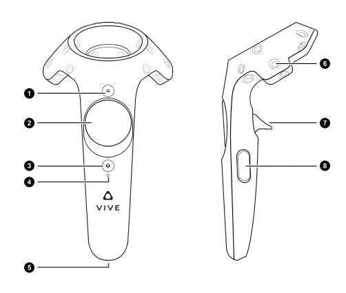

# Franka Teleoperation

This repo provides a script for teleoperating the Franka Panda robot using the VR setup from VIVE. It is necessary to set up the [`vive_ros`](https://github.com/robosavvy/vive_ros) streamer repo that connects to STEAM VR to stream the data from the controllers to ROS. Hopefully this repo can help in robotic manipulation research and dataset creation.

## Requirements
You will need ROS1 (tested on ROS Noetic), `libfranka`,`franka_ros`, [Franka Interactive Controllers](https://github.com/sophiamoyen/franka_interactive_controllers) and [`franka_zed_gazebo`](https://github.com/pearl-robot-lab/franka_zed_gazebo). The `pose_impedance_control_additional_params.yaml` contains tunable parameters for external tool compensation and nullspace stiffness. When the `cartesian_pose_impedance_controller` is launched in the teleoperation, it looks up that file that should be tuned accordingly (with the ZED2 camera attached to the wrist, for example).

## Setup without Docker

[ Setup locally ] (local_setup.md)

## 0. Docker image
You can get the current docker image of the environment being used for tests. You can follow the instructions on how to download docker and set up an alias for running a container with the required arguments in this repo: [Docker_env](https://github.com/pearl-robot-lab/Docker_env). Pull a docker image and create a container:
```
docker pull sophiamoyen/franka_teleop:07102024
```
```
docker_run_nvidia --name="franka_teleop" sophiamoyen/franka_teleop:07102024 bash
```
You should now be inside the container. To exit it, just type `exit` in the cmd. From now on, every time you want to enter the container, start it then execute it:
```
docker start franka_teleop
```
```
docker exec -it franka_teleop bash
git remote set-url origin https://github.com/AnshPrakash/franka_teleop.git
git pull --recurse-submodules
```

### Environment Variable

For Oculus & Droid

```
PYTHONPATH=$PYTHONPATH:/opt/ros_ws/src/franka_teleop/oculus_reader/
PYTHONPATH=$PYTHONPATH:/opt/ros_ws/src/franka_teleop/droid/
```

For Displaying correctly from docker container

```
export DISPLAY=:1
```


### Build & Source

```
cd /opt/ros_ws
catkin_make
source devel/setup.bash
```

### Install adb inside docker
```
apt update
apt install android-tools-adb
```

## 1. Start Franka controllers
### Simulation
If you haven't already, launch the simulation with the controllers. You need to have the package `franka_zed_gazebo` to launch in simulation (the launch file is getting the world and the robot description from that package)

With the ZED2 attached to the end-effector:

```
roslaunch franka_teleop franka_interactive_teleop_simulation.launch
```

Without camera:
```
roslaunch franka_teleop franka_interactive_teleop_wo_camera_simulation.launch
```

### Real World

To launch in the real world (not yet teste - not yet recommended), unlock the joints in the desk application, active FCI and put it in Execution mode. Then launch the controllers:
```
roslaunch franka_teleop franka_interactive_teleop_real.launch
```

## 2. Stream VR controllers
In Kasos PC (second Windows partition), open Steam, start Steam VR. If needed, change room setup in the dropdown menu. Choose Standing Only option and follow instructions. Then open a terminal (not windows powershell), on top of the terminal, there is an option to open a terminal with ROS Noetic connected to the Aegina PC. Make sure the controllers are turned on and are being detected. Then start streaming (make sure there is already a ros master to connect to):

```
roslaunch vive_launcher vive.launch
```

## 3. Start teleop script
Inside the scripts folder, run the python file:
```
python3 teleop.py
```

The robot will first open the gripper and go to standard pose using the `effort_joint_trajectory_controller`, originally `franka_ros`. Then it will switch to the `cartesian_pose_impedance_controller`. To start/stop the teleop, press the Home button in the VR controller (`1` in the drawing below). To go back to standard pose, press the pad button (`2` in the drawing). To open or close the gripper, press the trigger (`7` in the drawing).

<p align="center">
  
</p>

### To do still:
- Include max/min workspace for the xyz values
- Tune impedance controller considering external tools (camera)
- Implement a better way to close and open gripper
- Check out if there is a better way to implement the rotation of the gripper
- Not in here, but in the recording node read button state for starting/stopping recording